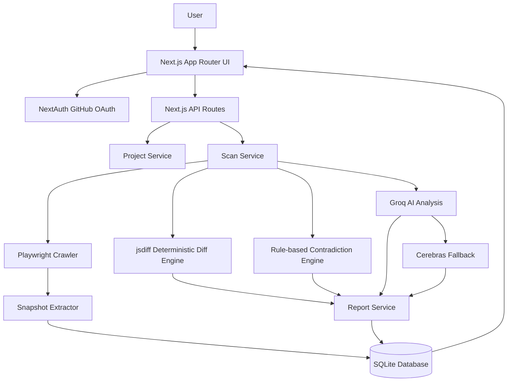
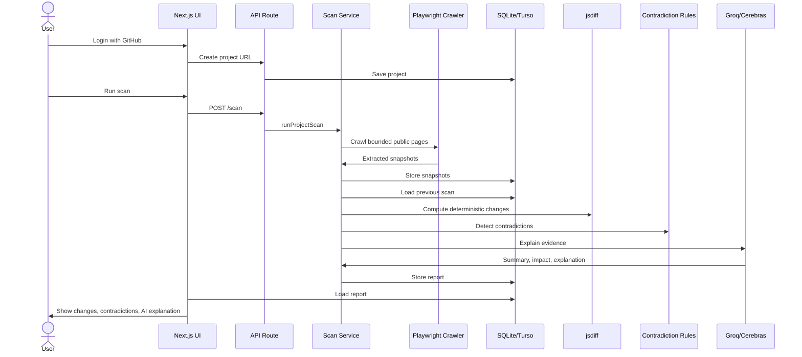

# TruthCI

**TruthCI** is a Public Product Truth Engine for detecting drift and contradictions across public product surfaces: landing pages, docs, pricing pages, API documentation, changelogs, release notes, and developer examples.

> Catch product contradictions before your users do.

TruthCI crawls bounded public URLs, stores snapshots, computes deterministic diffs, detects rule-based contradictions, and uses AI only to explain evidence-backed findings.

---

## Table of Contents

- [Product Summary](#product-summary)
- [Architecture](#architecture)
- [Vercel Deployment Status](#vercel-deployment-status)
- [Core Flow](#core-flow)
- [Tech Stack](#tech-stack)
- [Database Schema](#database-schema)
- [File Structure](#file-structure)
- [Environment Variables](#environment-variables)
- [Local Development](#local-development)
- [Deploy to GitHub and Vercel](#deploy-to-github-and-vercel)
- [GitHub OAuth Setup](#github-oauth-setup)
- [Turso SQLite Setup for Vercel](#turso-sqlite-setup-for-vercel)
- [Operational Notes](#operational-notes)
- [Known MVP Constraints](#known-mvp-constraints)

---

## Product Summary

Companies publish product information across many places. Over time, those sources drift.

Example:

| Surface | Claim |
|---|---|
| Website | `Unlimited API requests` |
| Pricing | `100k requests/month` |
| Docs | `Rate limits apply` |
| API behavior | `429 after 10k requests` |

TruthCI detects this kind of trust-breaking inconsistency by combining:

- Public crawling
- Snapshot storage
- Deterministic diffs
- Rule-based contradiction detection
- AI-generated explanation and impact summaries

AI is **not** the source of truth. AI only explains deterministic findings.

---

## Architecture



### Deployment Architecture

```mermaid
flowchart LR
  Browser[Browser] --> Vercel[Vercel Next.js App]
  Vercel --> GitHub[GitHub OAuth]
  Vercel --> Turso[(Turso/libSQL SQLite)]
  Vercel --> Groq[Groq API]
  Vercel --> Cerebras[Cerebras API optional]
  Vercel --> Chromium[@sparticuz/chromium + playwright-core]
```

---

## Vercel Deployment Status

This repo has been optimized for Vercel.

Important engineering decision:

| Environment | Database Driver | Persistence | Notes |
|---|---|---:|---|
| Local development | `better-sqlite3` | Yes | Uses `./data/truthci.db` |
| Vercel without Turso | `better-sqlite3` in `/tmp` | No | Works only as temporary demo data |
| Vercel with Turso | `@libsql/client` | Yes | Recommended production deployment |

Why Turso?

Vercel serverless does not provide a durable writable filesystem for SQLite files. Turso/libSQL is SQLite-compatible and gives TruthCI durable SQLite persistence on Vercel while keeping local development on `better-sqlite3`.

---

## Core Flow



---

## Tech Stack

| Layer | Technology |
|---|---|
| Frontend | Next.js 15 App Router, React, TypeScript |
| Styling | TailwindCSS, local shadcn-style UI primitives |
| Icons | Lucide React |
| Auth | NextAuth v4, GitHub OAuth |
| Local database | SQLite with `better-sqlite3` |
| Vercel database | Turso/libSQL SQLite via `@libsql/client` |
| Crawling | `playwright-core` with `@sparticuz/chromium` |
| Diff engine | `diff` / jsdiff |
| AI primary | Groq |
| AI fallback | Cerebras |
| Hosting | Vercel |

---

## Database Schema

### `users`

| Column | Type | Notes |
|---|---|---|
| `id` | TEXT | Internal user ID |
| `github_id` | TEXT | Unique GitHub profile ID |
| `email` | TEXT | Nullable |
| `name` | TEXT | Nullable |
| `image` | TEXT | Nullable |
| `created_at` | TEXT | Timestamp |

### `projects`

| Column | Type | Notes |
|---|---|---|
| `id` | TEXT | Project ID |
| `user_id` | TEXT | Owner |
| `name` | TEXT | Product/project name |
| `root_url` | TEXT | Root URL to monitor |
| `created_at` | TEXT | Timestamp |

### `scans`

| Column | Type | Notes |
|---|---|---|
| `id` | TEXT | Scan ID |
| `project_id` | TEXT | Project being scanned |
| `started_at` | TEXT | Start timestamp |
| `completed_at` | TEXT | Completion timestamp |
| `status` | TEXT | `pending`, `running`, `completed`, `failed` |
| `error` | TEXT | Failure message |

### `snapshots`

| Column | Type | Notes |
|---|---|---|
| `id` | TEXT | Snapshot ID |
| `scan_id` | TEXT | Parent scan |
| `url` | TEXT | Crawled URL |
| `title` | TEXT | Page title |
| `description` | TEXT | Meta description |
| `content` | TEXT | Extracted product text |
| `html` | TEXT | Raw HTML excerpt |
| `screenshot_path` | TEXT | Screenshot path, temporary on Vercel MVP |
| `links_json` | TEXT | Extracted links |
| `created_at` | TEXT | Timestamp |

### `reports`

| Column | Type | Notes |
|---|---|---|
| `id` | TEXT | Report ID |
| `scan_id` | TEXT | Unique parent scan |
| `summary` | TEXT | AI/fallback summary |
| `impact` | TEXT | AI/fallback impact |
| `explanation` | TEXT | AI/fallback explanation |
| `contradictions` | TEXT | JSON array |
| `changes` | TEXT | JSON array |
| `ai_provider` | TEXT | `groq`, `cerebras`, or null |
| `created_at` | TEXT | Timestamp |

---

## File Structure

```txt
truthci/
  app/
    page.tsx                         # Landing page
    layout.tsx                       # Root layout
    globals.css                      # Tailwind/global styles
    login/page.tsx                   # GitHub sign-in
    dashboard/page.tsx               # Project dashboard
    settings/page.tsx                # Account settings
    projects/
      new/page.tsx                   # Create project
      [projectId]/page.tsx           # Project details
      [projectId]/history/page.tsx   # Scan history
      [projectId]/scans/[scanId]/page.tsx
    api/
      auth/[...nextauth]/route.ts    # NextAuth route
      projects/route.ts              # List/create projects
      projects/[projectId]/route.ts  # Project details API
      projects/[projectId]/scan/route.ts
      scans/[scanId]/route.ts        # Scan result API

  components/
    ui/                              # Local shadcn-style primitives
    app-shell.tsx
    create-project-form.tsx
    run-scan-button.tsx
    project-card.tsx
    report-summary.tsx
    contradiction-card.tsx
    diff-viewer.tsx
    snapshot-list.tsx

  lib/
    auth/
      config.ts                      # NextAuth config
      session.ts                     # Server session helpers
    db/
      client.ts                      # Local SQLite + Turso adapter
      migrate.ts                     # Schema migration runner
      schema.sql                     # Database schema
      queries/                       # Database query modules
    services/
      project-service.ts
      scan-service.ts
      report-service.ts
    crawler/
      crawl.ts                       # Vercel-compatible Playwright crawler
      extract.ts                     # DOM extraction
      normalize-url.ts
      page-prioritizer.ts
      screenshots.ts
      types.ts
    diff/
      compute-diff.ts                # jsdiff logic
      normalize-content.ts
      types.ts
    contradictions/
      claim-rules.ts                 # Rule-based claim extraction
      detect-contradictions.ts
      types.ts
    ai/
      groq.ts
      cerebras.ts
      analyze-report.ts
      prompts.ts
      types.ts
    utils/
      urls.ts
      ids.ts
      dates.ts
      env.ts

  scripts/
    migrate.ts
    seed.ts

  data/                              # Local SQLite database only
  storage/screenshots/               # Local screenshots only
  public/logo.svg
  vercel.json                        # Vercel scan function settings
  .env.example
  package.json
  README.md
```

---

## Environment Variables

### Required on Vercel

| Variable | Required | Example | Notes |
|---|---:|---|---|
| `NEXTAUTH_URL` | Yes | `https://your-app.vercel.app` | Must match deployed URL |
| `NEXTAUTH_SECRET` | Yes | generated secret | Generate with `openssl rand -base64 32` |
| `GITHUB_CLIENT_ID` | Yes | `Ov23...` | From GitHub OAuth app |
| `GITHUB_CLIENT_SECRET` | Yes | `github_pat...` | From GitHub OAuth app |
| `TURSO_DATABASE_URL` | Yes for durable Vercel | `libsql://truthci-xxx.turso.io` | Turso database URL |
| `TURSO_AUTH_TOKEN` | Yes for durable Vercel | `eyJ...` | Turso database token |

### Recommended on Vercel

| Variable | Required | Recommended Value | Notes |
|---|---:|---|---|
| `GROQ_API_KEY` | Recommended | your Groq key | Enables primary AI explanations |
| `GROQ_MODEL` | No | `llama-3.1-70b-versatile` | Can be changed if model availability changes |
| `CEREBRAS_API_KEY` | Optional | your Cerebras key | AI fallback |
| `CEREBRAS_MODEL` | No | `llama3.1-70b` | Optional fallback model |
| `CRAWL_MAX_PAGES` | No | `5` | Keep low on Vercel MVP |
| `CRAWL_PAGE_TIMEOUT_MS` | No | `12000` | Keep scans under function limits |
| `SCREENSHOT_DIR` | No | `/tmp/truthci-screenshots` | Vercel temporary filesystem |

### Local only

| Variable | Required | Default | Notes |
|---|---:|---|---|
| `DATABASE_PATH` | No | `./data/truthci.db` | Local SQLite file |
| `PLAYWRIGHT_CHROMIUM_EXECUTABLE_PATH` | Optional | blank | Use if local Chromium cannot launch |

---

## Local Development

```bash
npm install
cp .env.example .env.local
npm run db:migrate
npm run dev
```

Then open:

```txt
http://localhost:3000
```

Local scans use `@sparticuz/chromium`. If Chromium does not launch on your local machine, set:

```env
PLAYWRIGHT_CHROMIUM_EXECUTABLE_PATH=/path/to/google-chrome
```

Examples:

```txt
macOS: /Applications/Google Chrome.app/Contents/MacOS/Google Chrome
Linux: /usr/bin/google-chrome
```

---

## Deploy to GitHub and Vercel

### 1. Create a GitHub repository

Go to GitHub and create an empty repository, for example:

```txt
truthci
```

Do not initialize with README if this workspace already has files.

### 2. Commit the code locally

```bash
git init
git add .
git commit -m "Initial TruthCI MVP"
```

### 3. Connect local repo to GitHub

Replace `YOUR_GITHUB_USERNAME` with your username or org:

```bash
git branch -M main
git remote add origin https://github.com/YOUR_GITHUB_USERNAME/truthci.git
git push -u origin main
```

### 4. Import project into Vercel

1. Go to [https://vercel.com/new](https://vercel.com/new)
2. Select the `truthci` GitHub repository
3. Framework should auto-detect as **Next.js**
4. Build command: `npm run build`
5. Install command: `npm install`
6. Output directory: leave empty/default
7. Add environment variables listed below
8. Click **Deploy**

### 5. Add Vercel environment variables

In Vercel:

```txt
Project → Settings → Environment Variables
```

Add these exact keys:

```env
NEXTAUTH_URL=https://YOUR-VERCEL-DOMAIN.vercel.app
NEXTAUTH_SECRET=PASTE_GENERATED_SECRET
GITHUB_CLIENT_ID=PASTE_GITHUB_CLIENT_ID
GITHUB_CLIENT_SECRET=PASTE_GITHUB_CLIENT_SECRET
TURSO_DATABASE_URL=PASTE_TURSO_DATABASE_URL
TURSO_AUTH_TOKEN=PASTE_TURSO_AUTH_TOKEN
GROQ_API_KEY=PASTE_GROQ_API_KEY
GROQ_MODEL=llama-3.1-70b-versatile
CRAWL_MAX_PAGES=5
CRAWL_PAGE_TIMEOUT_MS=12000
SCREENSHOT_DIR=/tmp/truthci-screenshots
```

Optional fallback:

```env
CEREBRAS_API_KEY=PASTE_CEREBRAS_API_KEY
CEREBRAS_MODEL=llama3.1-70b
```

### 6. Redeploy after setting env vars

After adding environment variables:

```txt
Vercel → Project → Deployments → latest deployment → Redeploy
```

---

## GitHub OAuth Setup

1. Go to GitHub:

```txt
Settings → Developer settings → OAuth Apps → New OAuth App
```

2. Fill in:

| Field | Value |
|---|---|
| Application name | `TruthCI` |
| Homepage URL | `https://YOUR-VERCEL-DOMAIN.vercel.app` |
| Authorization callback URL | `https://YOUR-VERCEL-DOMAIN.vercel.app/api/auth/callback/github` |

3. Copy the generated values into Vercel:

```env
GITHUB_CLIENT_ID=...
GITHUB_CLIENT_SECRET=...
```

4. Important: if you later add a custom domain, update both:

```env
NEXTAUTH_URL=https://your-custom-domain.com
```

and the GitHub OAuth callback URL:

```txt
https://your-custom-domain.com/api/auth/callback/github
```

---

## Turso SQLite Setup for Vercel

TruthCI needs durable SQLite on Vercel. Use Turso/libSQL.

### Option A: Turso CLI

Install and authenticate:

```bash
curl -sSfL https://get.tur.so/install.sh | bash
turso auth login
```

Create database:

```bash
turso db create truthci
```

Get database URL:

```bash
turso db show truthci --url
```

Create auth token:

```bash
turso db tokens create truthci
```

Add to Vercel:

```env
TURSO_DATABASE_URL=libsql://...
TURSO_AUTH_TOKEN=...
```

### Option B: Turso dashboard

1. Create a Turso account
2. Create a database named `truthci`
3. Copy database URL
4. Create database token
5. Add both to Vercel env vars

TruthCI auto-runs schema creation from `lib/db/schema.sql` on first authenticated usage/API call.

---

## Operational Notes

### Crawler limits

Vercel scan execution is intentionally bounded:

| Setting | Default on Vercel |
|---|---:|
| Max pages per scan | `5` |
| Page timeout | `12000ms` |
| Function max duration | `60s` |

The crawler only follows same-origin links and prioritizes URLs containing:

```txt
pricing, docs, documentation, api, developers, changelog, releases, updates, plans, features, security, terms, limits, support, status
```

### SSRF protections

TruthCI rejects obvious unsafe crawl targets:

- non-HTTP protocols
- localhost
- private IP ranges
- metadata IP `169.254.169.254`
- common auth/checkout paths
- asset files like PDFs, images, videos, CSS, JS, ZIPs

### AI failure behavior

Reports do not depend on AI availability.

If Groq fails:

1. TruthCI tries Cerebras
2. If Cerebras fails, deterministic fallback text is used
3. The scan still completes

---

## Known MVP Constraints

| Constraint | Current MVP Behavior | Future Upgrade |
|---|---|---|
| Scheduled scans | Manual scans only | Vercel Cron or background worker |
| Screenshot persistence on Vercel | Temporary `/tmp` path | Vercel Blob or S3 |
| Long crawls | Bounded to 5 pages on Vercel | Queue/background worker |
| Complex semantic contradictions | Rule-based only | More claim rules, not vector DB yet |
| Team management | Not included | Add organizations later |
| Billing | Not included | Add after validation |

---

## Validation

The current project validates with:

```bash
npm run typecheck
npm run build
```

The app builds successfully with Next.js 15 and is prepared for Vercel deployment.
